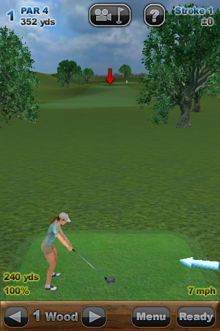
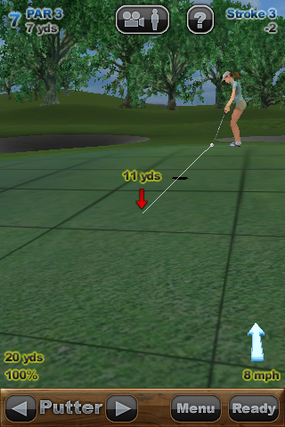

Anytime Golf: Magic Touch
=========================

"Anytime Golf: Magic Touch" is an interactive golf simulation game for iPhone and iPad
developed by [Robert Rose](http://robertwrose.com/) and Jake Helms through Bork 3D LLC.

In 2015 Bork 3D released the source code and source art material for the game to the
public under a permissive BSD-style open source license.

The source code includes the [Bork 3D Game Engine](https://en.wikipedia.org/wiki/Bork3D_Game_Engine),
a C++ game engine capable of targeting iOS, MacOS and Windows.

 

Compilation
===========

iOS
---

Xcode is required.

Open code/game/golf.xcodeproj and compile the iPhone or iPad, Debug or Release targets.

MacOS
-----

Xcode7 is required.

Open code/game/macos/example_macos.xcodeproj and compile the Debug or Release targets.

Windows
-------

Visual Studio 2013 is required.

FreeImage.dll is required to run the game. FreeImage is distributed under
less-permissive license terms so must be downloaded separately. You can obtain FreeImage.dll
from http://freeimage.sourceforge.net/ Place the file in code\game.

Open code\game\win32\game.sln and compile the Debug or Release targets.

Stereoscopic 3D
===============

The branch 'stereo_3d' contains an experimental port of Anytime Golf for Windows that renders
the game in stereoscopic 3D on nVidia 3D Vision systems.

Thanks to @tliron for the example code that outlines how to render OpenGL in a manner
compatible with nVidia 3D Vision. See https://github.com/tliron/opengl-3d-vision-bridge

License
=======

Source code and source artwork covered by LICENSE file.

Music Copyright (c) [Mick Rippon](https://soundcloud.com/mickrip). All Rights Reserved.
